# AI Seminar

## Recap: NLP 모델 발전의 큰 줄기

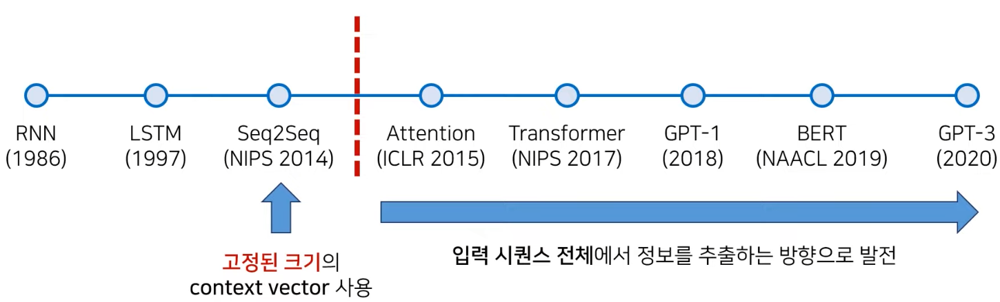
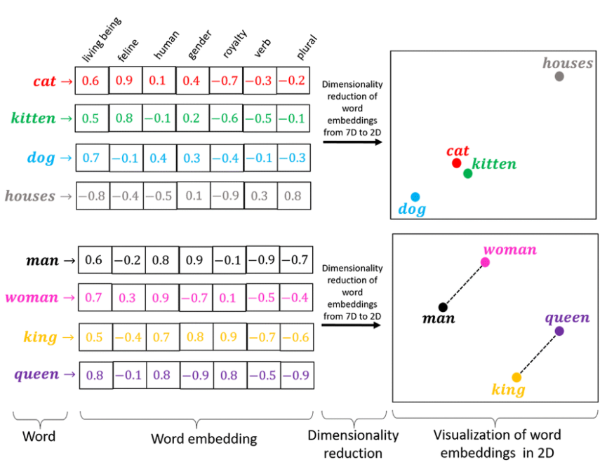

자연어처리(NLP) 모델의 역사는 “문장을 어떻게 표현할 것인가”라는 질문을 중심으로 발전해왔다. 초창기에는 단어를 벡터로 바꾸는 표현 학습이 중요했고, 이후에는 문맥을 반영하는 표현으로, 더 나아가 문장 전체의 관계를 직접 학습하는 구조로 확장되었다.

이 발표는 그 흐름을 따라가며, 특히 **Transformer encoder가 왜 강력한지**를 구조적으로 정리하고, 그 아이디어가 BERT 같은 언어 모델 및 ViT/MAE 같은 비전 모델로 어떻게 이어지는지까지 연결한다.

---
## Seq2Seq: “문장 → 문장”을 만드는 첫 표준 형태

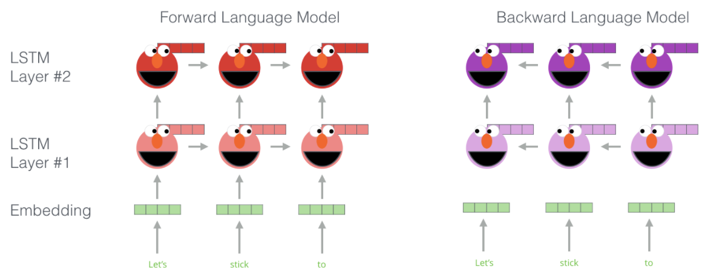

2014년 무렵, 기계번역 같은 “입력 시퀀스를 다른 길이의 출력 시퀀스로 변환”하는 문제를 풀기 위해 **Seq2Seq(Encoder–Decoder)** 구조가 제안되었다[1]. 기본 형태는 다음과 같다.

- **Encoder**: RNN(LSTM/GRU)을 여러 층 쌓아 입력 문장을 읽고, 요약된 표현(컨텍스트)을 생성
- **Decoder**: Encoder가 만든 컨텍스트를 바탕으로 출력 문장을 한 토큰씩 생성

하지만 여기에는 중요한 한계가 있다. 입력 문장이 길어질수록 **하나의 고정 길이 벡터**가 모든 정보를 담기 어렵다. 그래서 자연스럽게 다음 질문이 등장한다.

- 긴 문장을 “한 벡터로 요약”하지 말고, 출력 토큰을 만들 때 필요한 입력 부분에만 집중할 수는 없을까?

---

## Attention: “필요한 곳을 본다”는 아이디어

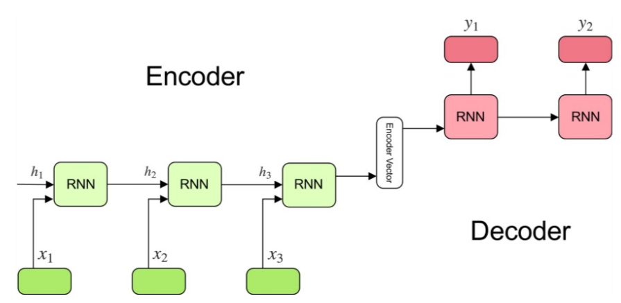
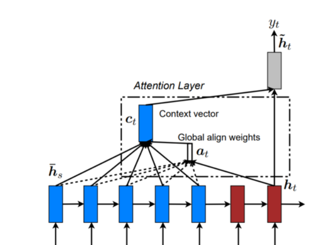

이 문제를 해결하기 위해 **Attention 메커니즘**이 도입된다[2],[3]. 핵심은 “문장 전체를 하나로 압축”하는 대신, 디코딩 시점마다 입력의 여러 위치(토큰) 중 **어디를 얼마나 볼지** 가중치를 학습하는 것이다.

- **Bahdanau attention**: 번역 과정에서 입력-출력 정렬(alignment)을 학습하며, 디코더 상태와 인코더 상태의 조합으로 주의(attention)를 계산[2]
- **Luong attention**: 모든 위치를 보는 **Global attention**, 일부 주변만 보는 **Local attention** 같은 변형을 제안[3]

이 시점부터 모델은 “문장의 중요한 단서가 어디인지”를 스스로 찾기 시작했고, 이 아이디어는 다음 단계로 이어진다.

---

## Transformer: “RNN 없이 Attention만으로” 문장을 다룬다

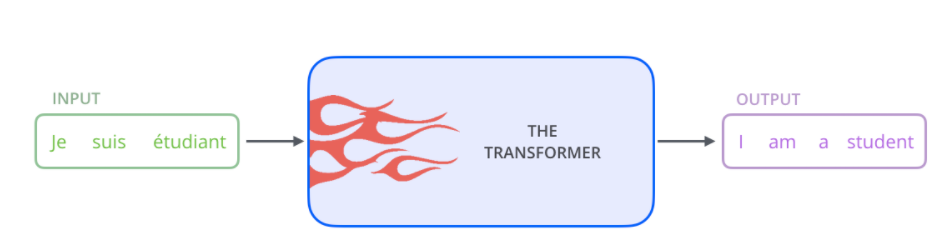

Transformer는 문장을 처리할 때 RNN/LSTM처럼 순차 처리를 강제하지 않고, **Attention을 중심으로** 입력 토큰들 사이의 관계를 직접 계산한다[4]. 구조는 Encoder–Decoder를 유지하지만, 이 발표의 핵심은 특히 **Transformer encoder**의 동작 원리다.

Transformer 전체 아키텍처를 시각적으로 이해하는 데는 아래 자료가 도움이 된다.

- [http://jalammar.github.io/illustrated-transformer/](http://jalammar.github.io/illustrated-transformer/)

---

## Transformer Encoder의 큰 그림

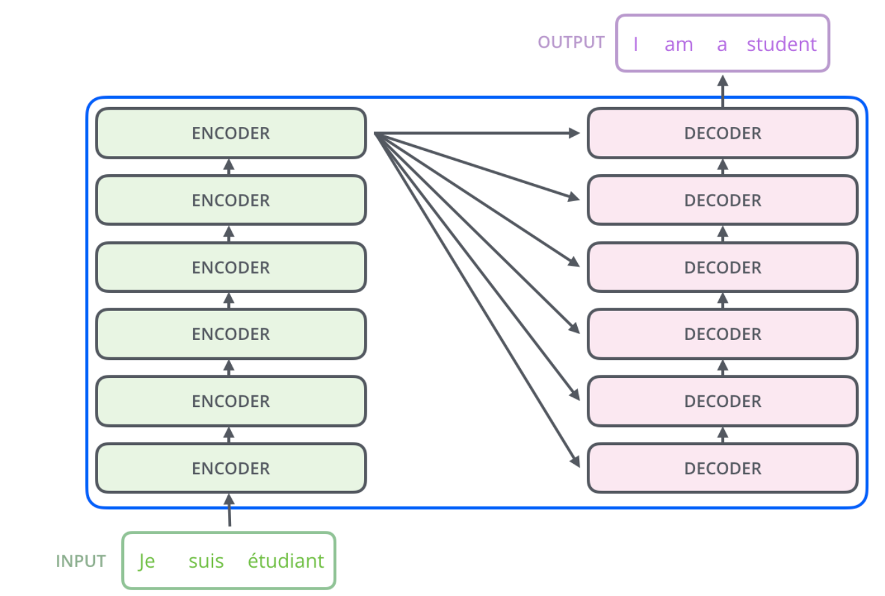

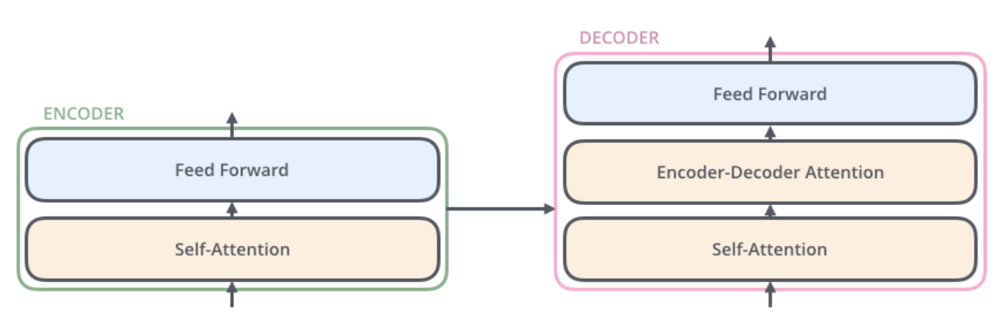
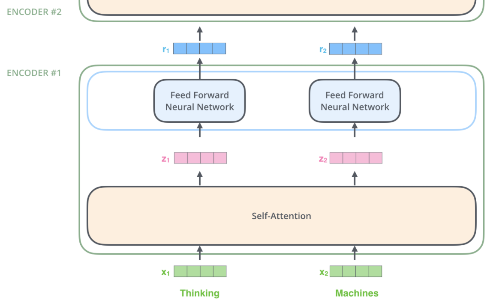

Transformer encoder는 여러 개의 동일한 블록을 층층이 쌓는다. 각 층은 구조는 같지만 가중치는 공유하지 않는다. 각 encoder 층은 크게 두 덩어리로 이해하면 된다.

- **Self-Attention**
- **Position-wise Feed-Forward Network(FFN)**

입력은 토큰 임베딩이며(예: Word2Vec 같은 임베딩 개념), 실제 구현에서는 여기에 위치 정보를 담기 위한 positional encoding을 함께 더하는 것이 일반적이다. 슬라이드에서는 입력 임베딩 예시로 Word2Vec을 함께 언급했다[5].

---

## Self-Attention 직관: “it”이 무엇을 가리키는지 찾기

Self-attention은 문장 안의 각 단어가 다른 단어들을 참고해 자신의 표현을 업데이트하도록 한다. 예를 들어 아래 문장에서,

> “The animal didn’t cross the street because it was too tired”

“it”이 무엇을 가리키는지 알려면 “it”을 처리할 때 문장 내 다른 토큰(예: animal)을 함께 봐야 한다. Self-attention은 바로 이 “서로를 참고하는 과정”을 학습한다.

---

## Self-Attention의 핵심 구성요소: Q, K, V

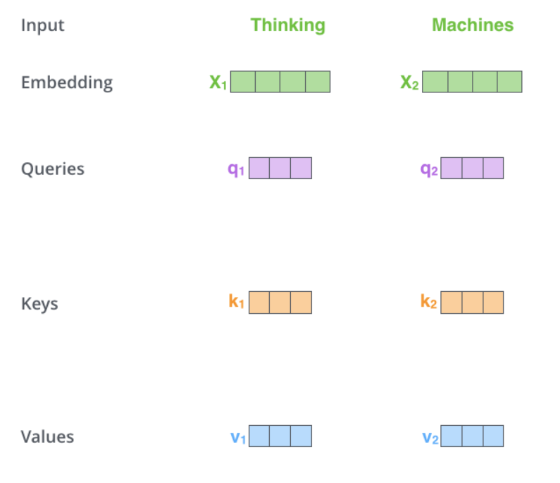

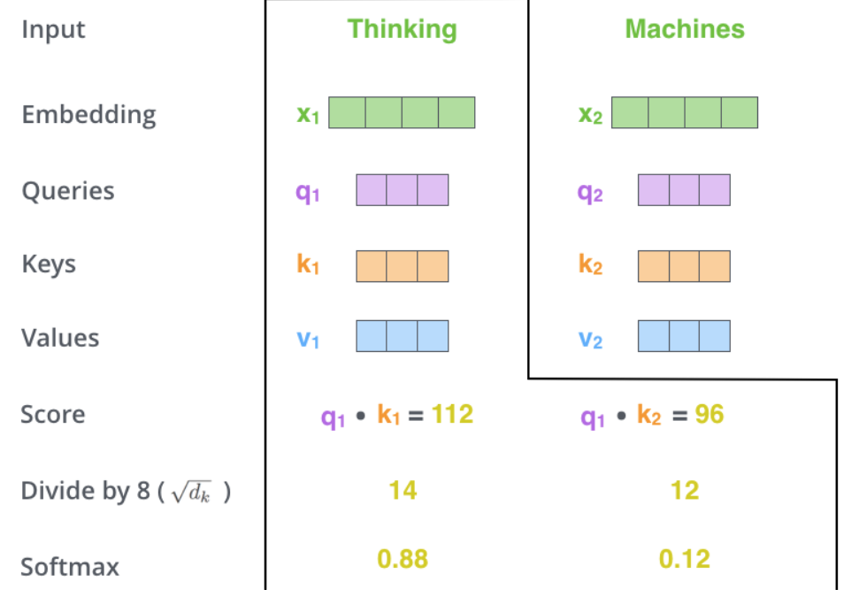

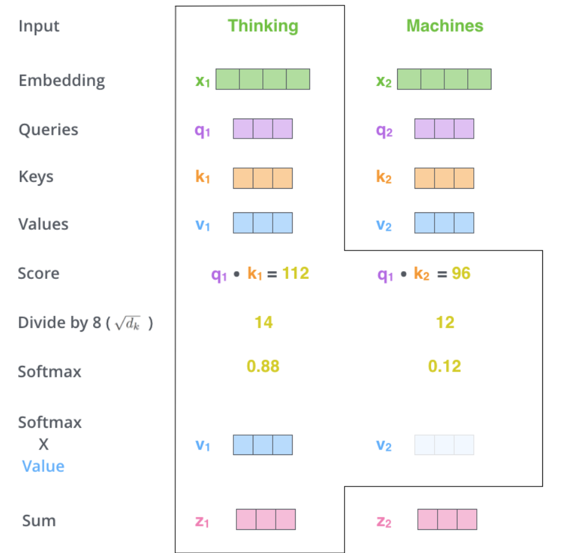

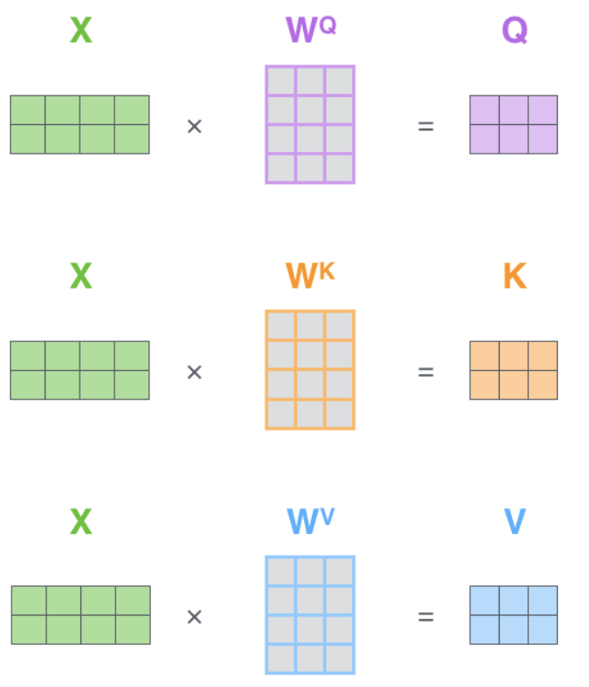

Self-attention은 각 토큰 벡터로부터 세 가지 벡터를 만든다.

- **Query(Q)**: 내가 무엇을 찾고 싶은지
- **Key(K)**: 내가 어떤 특징을 갖고 있는지
- **Value(V)**: 실제로 전달할 정보

여기서 중요한 포인트는 **임베딩 차원과 Q/K/V 차원이 같을 필요가 없고**, 학습 가능한 선형 변환으로 만들어진다는 점이다.

Self-attention 계산 흐름은 보통 다음과 같은 단계로 요약된다.

1. 각 토큰으로부터 Q, K, V를 만든다
2. Query와 Key의 내적(dot product)으로 유사도 점수를 만든다
3. 스케일링(보통 sqrt{d_k})로 나눔)하여 학습 안정성을 높인다
4. Softmax로 가중치(주의 분포)를 만든다
5. 그 가중치로 Value를 가중합하여 새로운 표현을 만든다

슬라이드의 행렬 그림은 이 과정을 “벡터 버전 → 행렬 버전”으로 확장해 보여주며, 핵심 메시지는 **병렬로 한 번에 계산 가능**하다는 점이다.

---

## Multi-Head Attention: “여러 관점으로 동시에 본다”

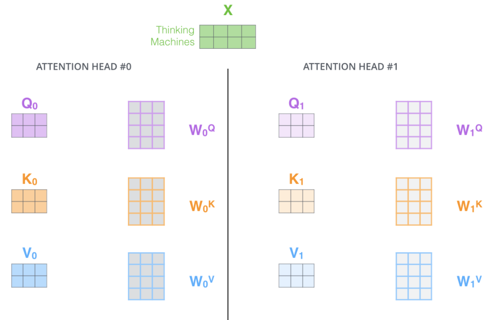
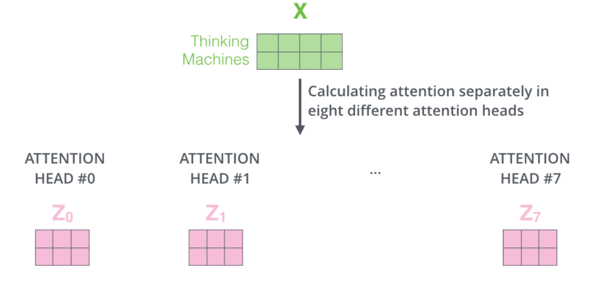
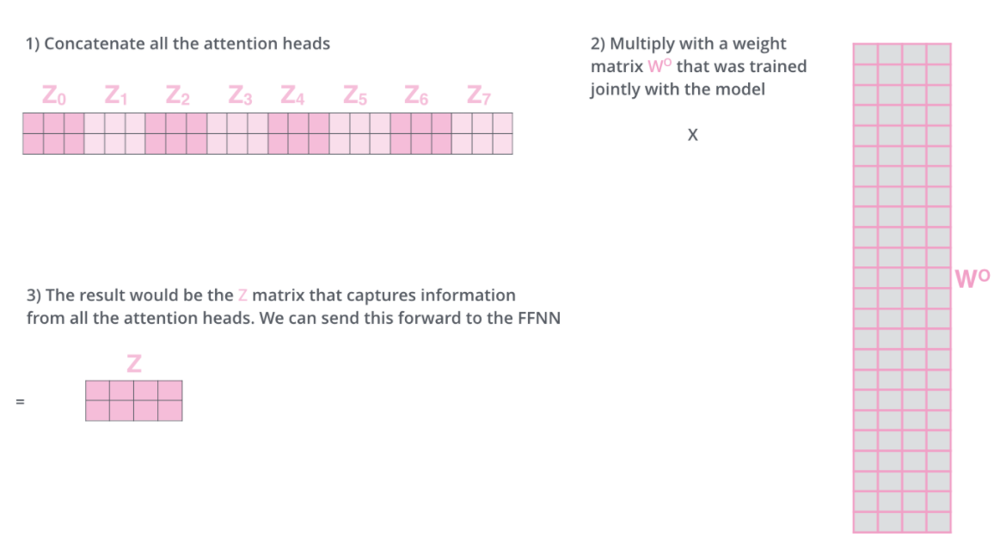
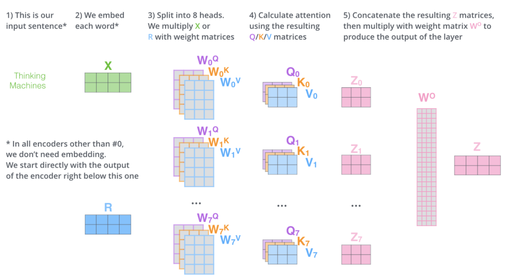
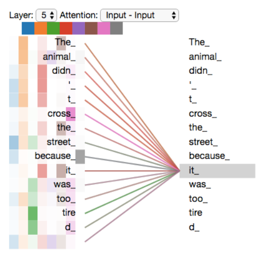

Single-head attention만 쓰면 한 가지 관계에 과도하게 집중하거나, 특정 토큰 자기 자신에만 크게 반응하는 문제가 생길 수 있다. Multi-head attention은 attention을 여러 개(head)로 나눠서,

- 서로 다른 하위 표현 공간(subspace)에서
- 서로 다른 관계 패턴(예: 지시어-대상, 수식 관계, 문법적 의존 등)을

동시에 학습하도록 한다.

각 head는 각자 Q/K/V 투영을 가진 채로 attention 결과(Z)를 만들고, 여러 head의 결과를 이어 붙인 뒤(concatenate) 다시 한 번 선형 변환으로 “다음 층이 받을 하나의 행렬”로 압축한다. 슬라이드의 ‘여러 head → 여러 Z → 하나로 condense’ 그림은 이 과정을 요약한다.

---

## Word2Vec: 단어를 벡터로 표현하지만 “문맥”은 모른다

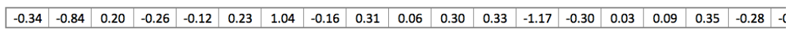

Word2Vec은 “비슷한 위치에서 등장하는 단어는 비슷한 의미”라는 분포 가설을 바탕으로, 단어를 고정된 벡터로 학습한다[5].

- **CBOW**: 주변 단어들로 중심 단어를 맞추는 방식
- 슬라이딩 윈도우로 주변 문맥을 샘플링하며 학습

다만 Word2Vec의 임베딩은 단어 하나당 “하나의 벡터”이기 때문에, 같은 단어라도 문맥에 따라 의미가 달라지는 현상(다의성)을 잘 반영하지 못한다. 예를 들어 “bank”는 문맥에 따라 은행/강둑 의미가 달라지지만, Word2Vec은 이를 분리하기 어렵다.

---

## ELMo: 문맥을 반영한 단어 임베딩

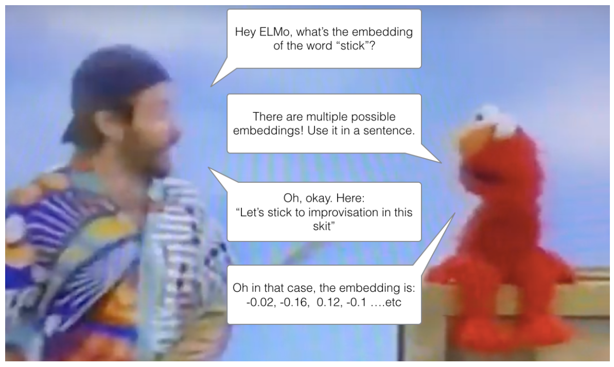
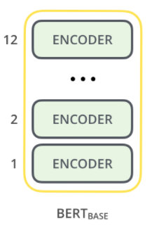

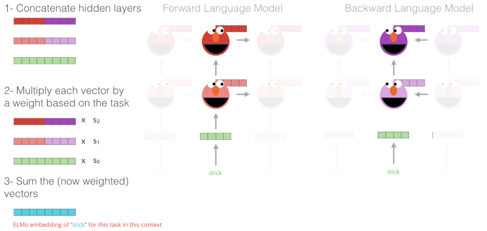

그래서 등장한 것이 **문맥 기반(contextual) 임베딩**이다. ELMo는 “단어 임베딩을 고정 테이블로 두는 것” 대신, **문장 전체를 보고** 각 단어의 임베딩을 만들어 낸다.

핵심 아이디어는 간단하다.

- 같은 “stick”이라도 문장 속 역할/의미에 따라 다른 표현을 가져야 한다
- 모델이 문맥을 통해 그 차이를 학습하도록 한다

이 흐름은 곧 Transformer encoder 기반의 대규모 사전학습(pretraining)으로 이어진다.

---

## BERT: Transformer Encoder를 사전학습의 중심으로

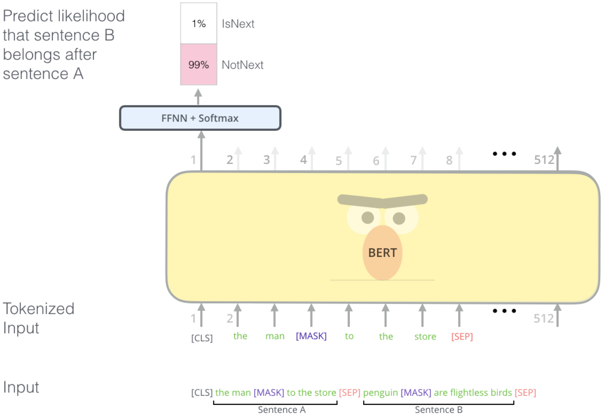
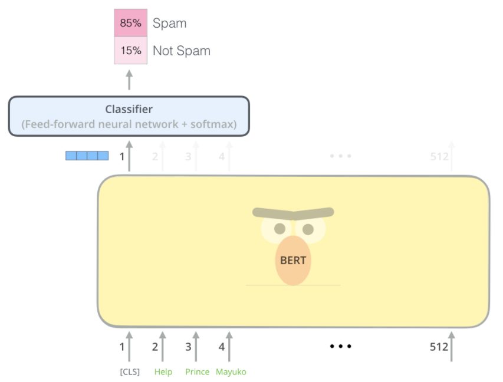

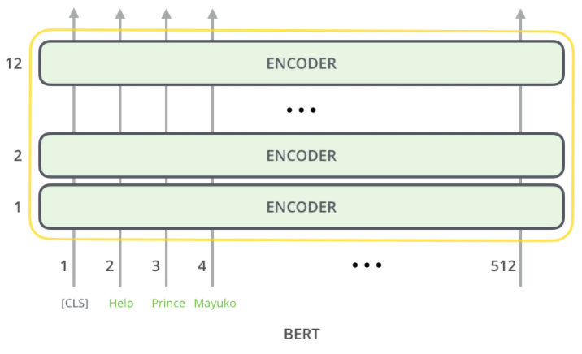

BERT는 “단어/문장/언어를 어떻게 표현해야 downstream task에서 강력할까?”라는 질문에 대해, **Transformer encoder**를 기반으로 언어 표현(language representation)을 학습한다[7]. 그리고 fine-tuning으로 다양한 NLP task(분류, 질의응답 등)에 적용할 수 있게 설계되었다.

BERT의 핵심 사전학습 목표는 두 가지로 요약된다.

### Masked Language Model(MLM): 일부를 가리고 맞히기

문장의 일부 토큰(대략 15%)을 가리고, 그 단어를 맞히도록 학습한다. 이 과정에서 일부는 [MASK], 일부는 랜덤 단어, 일부는 원래 단어로 남겨 “노이즈가 섞인 상태”에서도 문맥 이해를 강제한다.

예:

- 나는 하늘이 예쁘다고 생각한다 → 나는 하늘이 [Mask] 생각한다.
- 나는 하늘이 예쁘다고 생각한다 → 나는 하늘이 흐리다고 생각한다.
- 나는 하늘이 예쁘다고 생각한다 → 나는 하늘이 예쁘다고 생각한다.

이 방식은 라벨이 없어도 학습되는 **self-supervised learning**의 대표적인 형태다.

### Next Sentence Prediction(NSP): 문장 관계 학습

두 문장을 붙여 넣고, 두 번째 문장이 첫 번째 문장의 “정상적인 다음 문장인지”를 맞히게 한다. 이를 통해 문장 간 관계를 학습하도록 의도했다.

### Fine-tuning: 분류 문제로 연결

분류 task의 경우, 사전학습된 encoder 위에 task-specific head(예: dense layer)를 붙여 fine-tuning한다. 슬라이드의 예시는 문장 분류를 염두에 두고, class label 수에 맞는 출력층을 추가하는 전형적인 구성을 설명한다.

---

## ViT: Transformer encoder가 “언어 밖”으로 확장되다

Transformer encoder의 아이디어는 NLP에서 강력함이 증명된 뒤, 비전으로 확장된다. ViT(Vision Transformer)는 이미지를 패치(patch) 단위의 토큰으로 쪼개어, 문장처럼 토큰 시퀀스로 보고 transformer encoder에 넣는다[8].

공통점:

- Transformer encoder 구조 사용
- CLS token 기반 분류 헤드 사용

차이점:

- 텍스트가 아니라 **이미지 패치 토큰**을 입력으로 사용
- BERT처럼 mask를 기본 전제로 쓰지 않는 구성(초기 ViT 기준)

---

## MAE: “BERT의 마스킹 아이디어”를 비전에 맞게 재해석

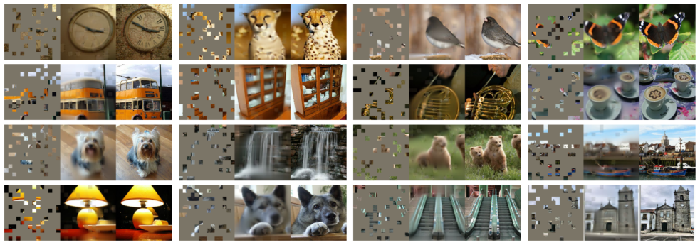
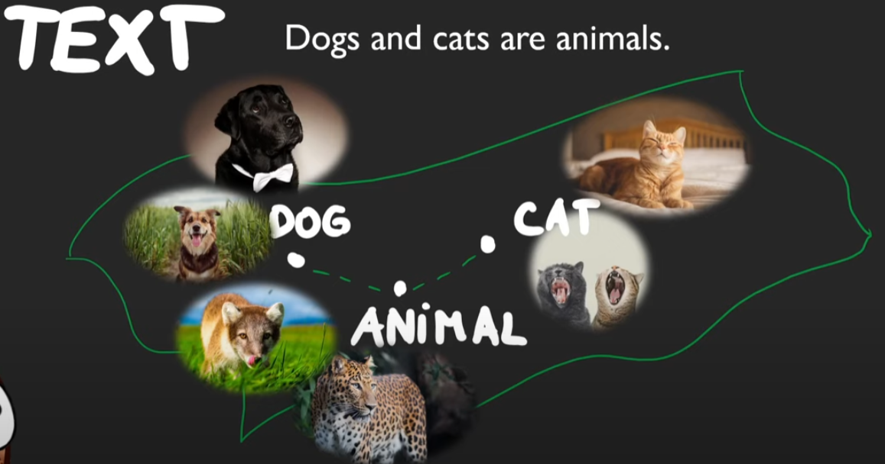

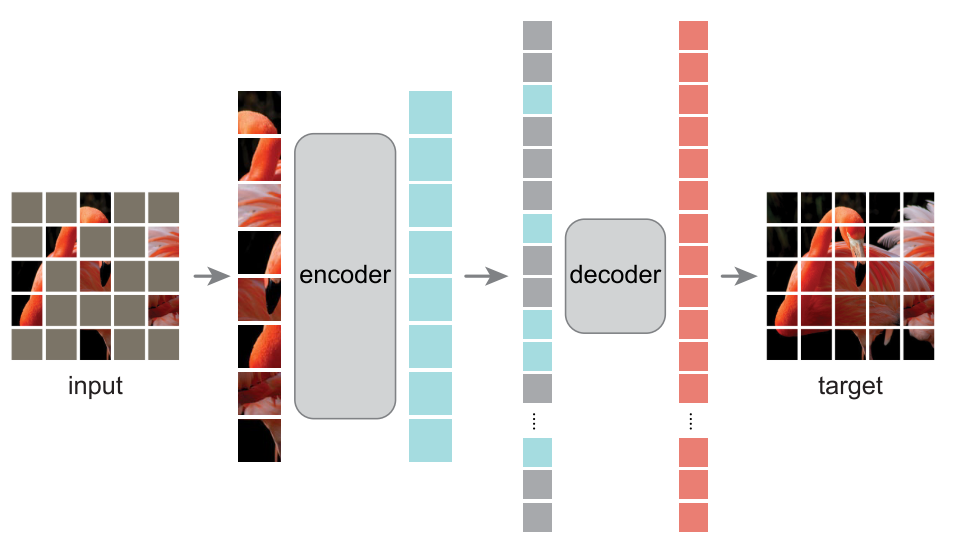
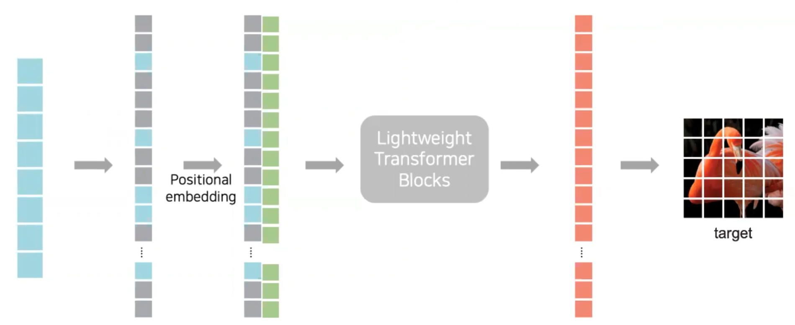
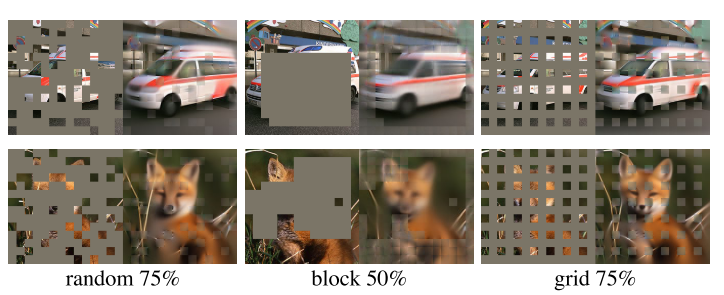
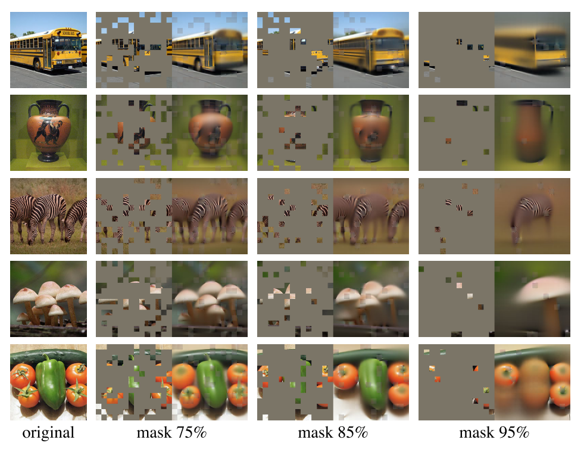

MAE(Masked Autoencoders)는 “언어에서 성공한 마스킹 사전학습을 이미지에도 적용할 수 있을까?”라는 질문에서 출발한다[9]. 다만 이미지와 언어는 신호 특성이 크게 다르다.

- **언어**: 인간이 만든 정보 밀도 높은 신호(의미가 압축되어 있음)
- **이미지**: 공간적 중복이 크고, 이웃 패치로 빈칸을 메우기 쉬움(저수준 복원만으로도 성립)

따라서 마스킹을 했을 때,

- 언어에서는 “가려진 단어”가 풍부한 의미를 담고 있어 고수준 이해가 필요하지만
- 비전에서는 단순 보간/인페인팅으로도 어느 정도 복원이 가능해, 설계를 다르게 가져가야 한다

MAE 관점에서 decoder는 “잠재표현(latent representation)을 다시 입력으로 매핑”하는 역할을 하지만, 텍스트와 이미지에서 그 역할의 성격이 달라진다.

- **Vision**: decoder가 픽셀을 복원하며, 출력은 인식(recognition) task 대비 상대적으로 저수준
- **Language**: decoder가 의미가 풍부한 단어를 예측해야 하므로 더 고수준의 이해가 요구됨

슬라이드의 Architecture/Result 파트는 이런 설계 차이가 실제로 어떤 성능/학습 효율로 이어지는지를 시각적으로 요약한다.

---

## Conclusion

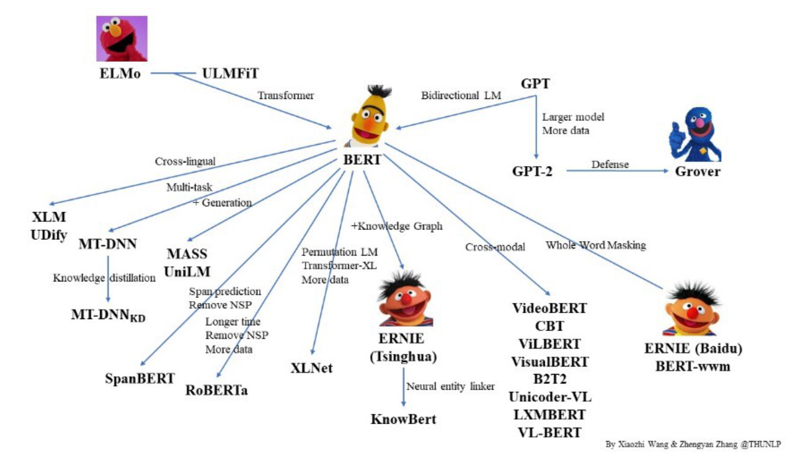

오늘 다룬 흐름은 다음처럼 정리된다.

- **Word2Vec**: 단어를 벡터로 (하지만 문맥 반영은 약함)
- **ELMo**: 문맥 기반 임베딩으로 한 단계 확장
- **Transformer encoder**: 토큰 간 관계를 attention으로 직접 학습하는 강력한 구조
- **BERT**: Transformer encoder + 마스킹 기반 사전학습으로 NLP 전반을 재구성
- **ViT/MAE**: encoder 중심 설계가 비전으로도 확장되며, 마스킹 아이디어가 영역 특성에 맞게 변형

- ELMo: Embeddings from Language Models
- BERT: Bidirectional Encoder Repersentations from Transformer
- ERNIE: Enhanced Language Representation with Informative Entities

---

## References

- A. Vaswani et al., "Attention is all you need," in Advances in neural information processing systems, 2017, pp. 5998-6008.
- T. Mikolov, K. Chen, G. Corrado, and J. Dean, "Efficient estimation of word representations in vector space," arXiv preprint arXiv:1301.3781, 2013. (Word2Vec)
- I. Sutskever, O. Vinyals, and Q. V. Le, "Sequence to sequence learning with neural networks," in Advances in neural information processing systems, 2014, pp. 3104-3112.
- D. Bahdanau, K. Cho, and Y. Bengio, "Neural machine translation by jointly learning to align and translate," arXiv preprint arXiv:1409.0473, 2014. [ICLR 2015]
- M.-T. Luong, H. Pham, and C. D. Manning, "Effective approaches to attention-based neural machine translation," arXiv preprint arXiv:1508.04025, 2015.
- (ELMo) M. Peters et al., "Deep contextualized word representations. arXiv 2018," arXiv preprint arXiv:1802.05365, vol. 12, 1802.
- J. Devlin, M.-W. Chang, K. Lee, and K. Toutanova, "Bert: Pre-training of deep bidirectional transformers for language understanding," arXiv preprint arXiv:1810.04805, 2018.
- K. He, X. Chen, S. Xie, Y. Li, P. Dollár, and R. Girshick, "Masked Autoencoders Are Scalable Vision Learners," arXiv preprint arXiv:2111.06377, 2

