# AI Seminar

## 자연어 처리의 발전사

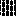

NLP (Natural Language Processing)은 2가지 큰 연구 흐름속에 발전해왔다. 

- **Word Embedding(표현) 발전 흐름**: 단어/문장을 어떻게 벡터로 표현할 것인가(BoW/TF-IDF → Word2Vec → ELMo → encoder pretraining)
- **NLP 모델/학습방법 발전 흐름**: 어떤 구조로 문장을 처리하고 학습할 것인가(RNN/LSTM → Seq2Seq → Attention → Transformer → BERT/GPT …)

---

## Part A. Word Embedding(표현) 발전 흐름

### A1. BoW / TF-IDF

**(Key papers / year)**: TF-IDF (1988)[10]

딥러닝 이전의 전통적인 NLP 표현은 “문서/문장을 어떤 특징 벡터로 만들 것인가”에 초점이 있었다.

- **Bag-of-Words(BoW)**: 단어 등장 빈도로 문서를 표현하지만, **단어 순서 정보가 사라진다**
- **TF-IDF**: 자주 등장하지만 구분력이 낮은 단어는 낮추고, 문서를 구분해주는 단어는 강조하는 가중치 방식[10]

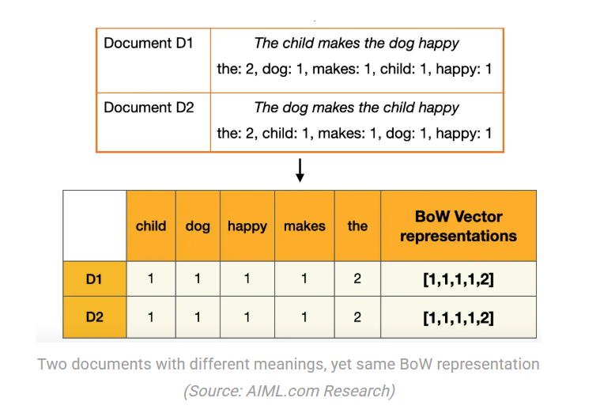

하지만 이 방식은 “문맥”이나 “의미의 조합(구문/의존관계)”을 직접 표현하기 어렵다.

- **순서/구문 정보 손실**: BoW/TF-IDF는 단어 “주머니”라서 단어 순서가 사라진다.
- **희소값의 문제, 차원의 증가**: 어휘 크기만큼 차원이 커지고 대부분 0인 벡터가 된다.
- **의미 유사도 표현 한계**: 의미적으로 가까운 단어를 “연속 공간에서 가깝게” 두는 표현이 아니다.

---

### A2. Word2Vec: 단어를 dense 벡터로

**(Key papers / year)**: Word2Vec (2013)[5]

BoW/TF-IDF의 희소한 표현은 의미 유사도를 부드럽게 담기 어렵다. Word2Vec은 “비슷한 문맥에 등장하는 단어는 비슷한 의미”라는 가설로, 단어를 **저차원 dense 벡터 공간**에 배치해 의미 유사도를 직접 학습함으로써 “범용 단어 표현”의 출발점을 제공한다[5].

- **CBOW**: 주변 단어들로 중심 단어를 맞추는 방식
- 슬라이딩 윈도우로 주변 문맥을 샘플링하며 학습

다만 Word2Vec의 임베딩은 단어 하나당 “하나의 벡터”이기 때문에, 같은 단어라도 문맥에 따라 의미가 달라지는 현상(다의성)을 잘 반영하지 못한다.

---

### A3. ELMo: token-level contextual embedding으로 확장

**(Key papers / year)**: ELMo (2018)[6]

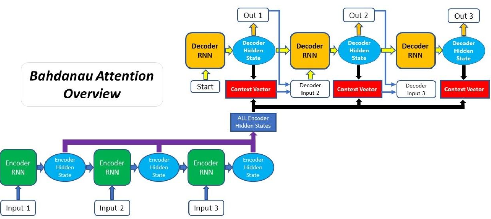

그래서 등장한 것이 **문맥 기반(contextual) 임베딩**이다. ELMo는 “단어 임베딩을 고정 테이블로 두는 것” 대신, **문장 전체를 보고** 각 단어의 임베딩을 만들어 낸다[6]. 즉 표현의 단위가 “타입(type) 단어”에서 “토큰(token) 단어”로 바뀌며, 같은 단어라도 문맥에 따라 다른 벡터를 갖게 된다.

- 같은 “stick”이라도 문장 속 역할/의미에 따라 다른 표현을 가져야 한다
- 모델이 문맥을 통해 그 차이를 학습하도록 한다

이제 다음 질문은 “이런 문맥 표현을 어디에 쓰는가?”다. 당시 NLP에서 풀고 싶었던 대표적인 downstream task는 다음과 같다.

- **문장 분류**: 감성 분석, 토픽 분류 등
- **문장 관계**: 자연어 추론(NLI), 유사 문장 판별, 패러프레이즈
- **토큰 단위 태스크**: 개체명 인식(NER), 품사 태깅(POS), 의미역(SRL)
- **질의응답(QA)**: 주어진 문서에서 답 span을 찾기

ELMo는 강력했지만, 보통 “특징(feature)로 추출해서” 기존 모델 위에 얹는 형태가 많았고, RNN 기반 언어모델의 순차 계산 특성 때문에 **더 큰 데이터/모델로 스케일업**하는 데 제약이 있었다[6]. 그래서 연구의 관심은 “문맥 임베딩”을 넘어, 다양한 NLP 태스크에서 공통으로 잘 작동하는 **범용 표현을 대규모로 사전학습하고, 필요하면 end-to-end로 fine-tuning**하는 방향으로 이동한다.

이 흐름이 **Transformer encoder 기반의 대규모 사전학습(pretraining)**으로 이어지는 이유는 명확하다.

- **양방향 문맥(bidirectional) 표현**을 encoder에서 자연스럽게 만들 수 있고
- self-attention으로 **병렬 학습**이 가능해 스케일업에 유리하며
- 사전학습된 encoder를 task head와 함께 **fine-tuning**해 다양한 태스크로 쉽게 전이할 수 있기 때문이다[4],[7].

---

## Part B. NLP 모델/학습방법 발전 흐름

### B1. RNN / LSTM: 순서 모델링과 언어모델 학습

**(Architecture / year)**: RNN (1980s~; BPTT 계열 정립 1986)[16],[17] · LSTM (1997)[12]

**(Key papers / year)**: RNN LM (2010)[13] · Kim CNN (2014)[11]

“문맥”을 다루려면 결국 **순서(sequence)** 정보를 모델링해야 한다. RNN/LSTM은 토큰을 순차적으로 처리하며 hidden state로 정보를 누적해 순서를 모델링하고, 언어모델은 다음 토큰 예측 \(p(w_t \mid w_{<t})\)로 이를 학습한다[13].

- **CNN for sentence**: n-gram처럼 **국소(local) 패턴**을 잘 잡아내는 문장 분류 모델[11]

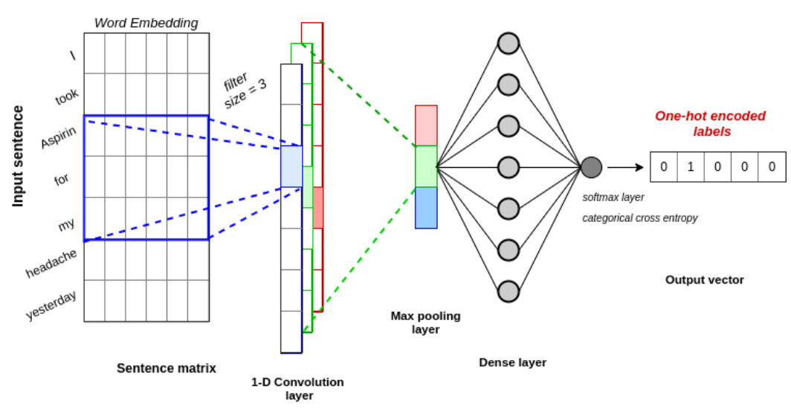

- **RNN / LSTM 언어모델**: 장기 의존을 완화하기 위한 LSTM 게이트 구조[12], RNN LM의 다음 단어 예측 학습[13]

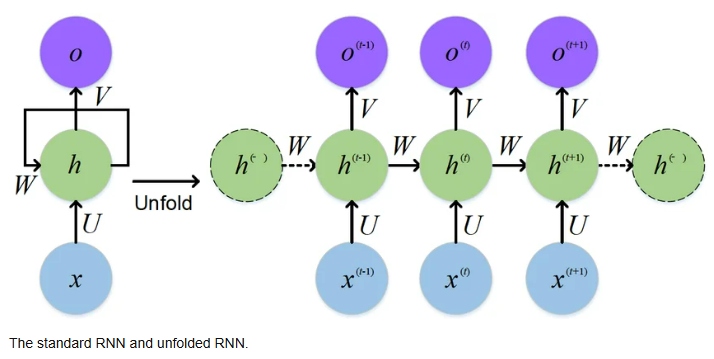
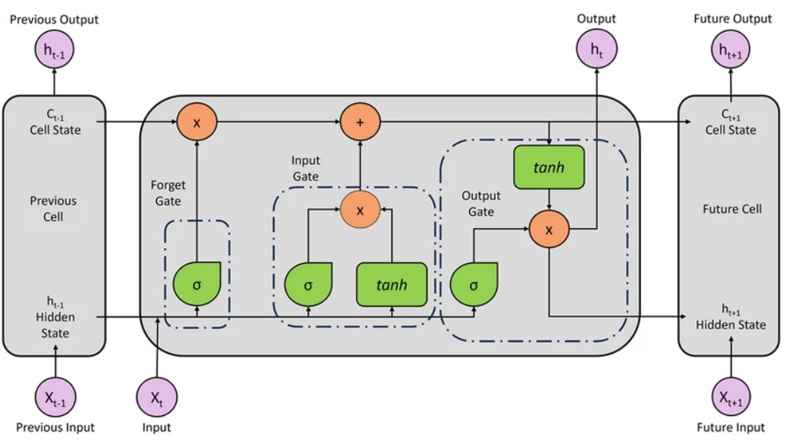

RNN/LSTM 언어모델은 Word2Vec처럼 “임베딩을 먼저 따로 학습”해 쓰기보다, 언어모델 학습 과정에서 단어 표현(입력 임베딩)을 **end-to-end로 함께 학습**하는 경우가 많다.

- **입력 표현**: 단어를 보통 vocabulary 크기의 **원-핫(one-hot)** 벡터로 두고, 이를 **임베딩 행렬(lookup table)**로 투영해 dense 벡터를 만든 뒤 RNN/LSTM에 입력
- **학습 목표**: hidden state로부터 softmax를 통해 다음 단어 분포를 예측하고, 크로스엔트로피로 학습[13]

---

### B2. Seq2Seq: “문장 → 문장” 학습의 표준 형태

**(Key papers / year)**: Seq2Seq (2014)[1]

기계번역처럼 “입력 시퀀스를 다른 길이의 출력 시퀀스로 변환”하는 문제를 풀기 위해 **Seq2Seq(Encoder–Decoder)** 구조가 제안되었다[1].

- **Encoder**: RNN(LSTM/GRU)을 여러 층 쌓아 입력 문장을 읽고, 요약된 표현(컨텍스트)을 생성
- **Decoder**: Encoder가 만든 컨텍스트를 바탕으로 출력 문장을 한 토큰씩 생성

하지만 입력이 길어질수록 **하나의 고정 길이 벡터**가 모든 정보를 담기 어렵다는 한계가 있다.

---

### B3. Attention: “필요한 곳을 본다”

**(Key papers / year)**: Bahdanau attention (2015)[2] · Luong attention (2015)[3]

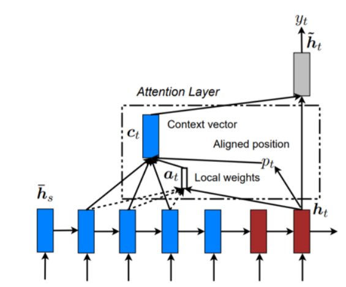

고정 길이 요약의 한계를 넘기 위해 **Attention 메커니즘**이 도입된다[2],[3]. 디코딩 시점마다 입력의 여러 위치 중 어디를 얼마나 볼지 학습한다.

### Attention vs Self-Attention

- **(Encoder–Decoder) Attention**: 출력 토큰 생성 시 입력을 참고하는 **cross-attention**[2],[3]
- **Self-Attention**: 시퀀스 내부 토큰 간 관계를 계산해 표현을 업데이트(Transformer 핵심)[4]

---

### B4. Transformer: RNN 없이 self-attention만으로

https://jalammar.github.io/illustrated-transformer/

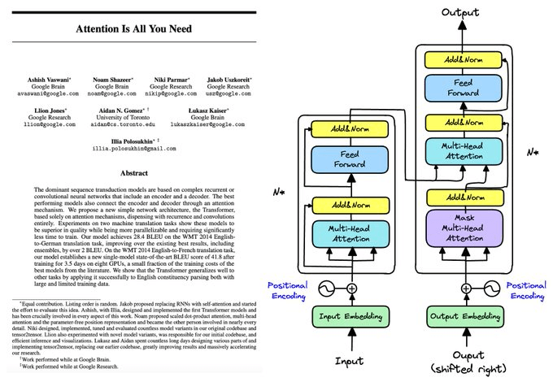

**(Key papers / year)**: Transformer (2017)[4]

Transformer는 순차 처리를 강제하지 않고 self-attention으로 토큰 간 관계를 직접 계산한다[4].

#### Transformer가 game changer였던 이유

- **병렬 처리 가능(속도/스케일)**[4]
- **Long-range dependency에 강함**[4]
- **짧은 gradient path**[4]

Transformer encoder 내부(큰 그림, QKV, multi-head)는 아래 섹션에서 직관적으로 정리한다.

---

#### Transformer Encoder의 원리

Transformer encoder는 여러 개의 동일한 블록을 층층이 쌓는다. 각 encoder 층은 크게 두 덩어리로 이해하면 된다.

- **Self-Attention**
- **Position-wise Feed-Forward Network(FFN)**

입력은 토큰 임베딩이며, 구현에서는 positional encoding을 더하는 것이 일반적이다[4].

#### Self-Attention 직관: “it”이 무엇을 가리키는지 찾기

- **Self-attention은 문장 안의 각 단어가 다른 단어들을 참고해 자신의 표현을 업데이트**하도록 한다.
- **Self-Attention의 핵심 구성요소**는 Query, Key, Value 이다.

Self-attention은 각 토큰 벡터로부터 Query/Key/Value를 만들고, 유사도 기반 가중합으로 새로운 표현을 만든다[4].

---

#### Multi-Head Attention: “여러 관점으로 동시에 본다”

Multi-head attention은 서로 다른 하위 표현 공간에서 서로 다른 관계 패턴을 동시에 학습하도록 한다[4].

---

### B5. 대규모 사전학습(Pretraining)과 전이(Fine-tuning): BERT vs GPT

#### BERT: Transformer Encoder를 사전학습의 중심으로 downstream TASK를 해결결

https://jalammar.github.io/illustrated-bert/

**(Key papers / year)**: BERT (2018)[7]

BERT는 Transformer encoder를 기반으로 언어 표현을 학습하고, fine-tuning으로 다양한 NLP task에 전이한다[7].

#### GPT 계열: Transformer Decoder로 “생성”을 한다

https://jalammar.github.io/illustrated-gpt2/

**(Key papers / year)**: GPT-1 (2018)[14] · GPT-3 (2020)[15] 

- **Encoder 중심**: BERT처럼 bidirectional 이해[7]
- **Decoder-only 중심**: GPT처럼 causal 자기회귀 생성[14]

---

### B6. Transformer의 아이디어가 Vision으로 확장되며 비전의 병목을 풀기 시작하다.

기존 Vision Task의 한계

- **전이/일반화 한계**: 한 태스크/데이터셋에서 잘 되던 표현이 다른 태스크로 바로 잘 옮겨가지 않았다.
- **전역 관계 모델링의 비효율**: 이미지 전체의 장거리 관계를 효율적으로 모델링하기 어렵거나, 설계(커널/피라미드 등)에 강한 귀납 편향이 필요했다.

이런 문제를 배경으로 “패치 토큰 + self-attention + 대규모 사전학습/자기지도”로 이어지는 ViT 계열 흐름이 본격화된다.

#### Vision Transformer(ViT)

https://medium.com/analytics-vidhya/illustrated-vision-transformers-165f4d0c3dd1

**(Key papers / year)**: ViT (2021)[8]

Transformer encoder가 비전으로 확장되어, 이미지를 패치 토큰 시퀀스로 보고 encoder에 넣는다[8].

#### Masked Auto Encoder (MAE)

**(Key papers / year)**: MAE (2022)[9]

MAE는 BERT에서 사용되었던 “마스킹 기반 사전학습”을 비전에 맞게 재해석한 방법이다[9].

#### CLIP: 비전-언어 정렬로 “전이 가능한” 비전 모델

CLIP은 이미지와 텍스트를 같은 임베딩 공간에 정렬시키는 대조학습(contrastive learning)으로, 자연어로 정의된 클래스/개념에 대한 zero-shot 전이를 강하게 만들었다[20]. 이후 멀티모달 모델(VLM)과 비전+LLM 결합 흐름의 중요한 출발점이 된다.

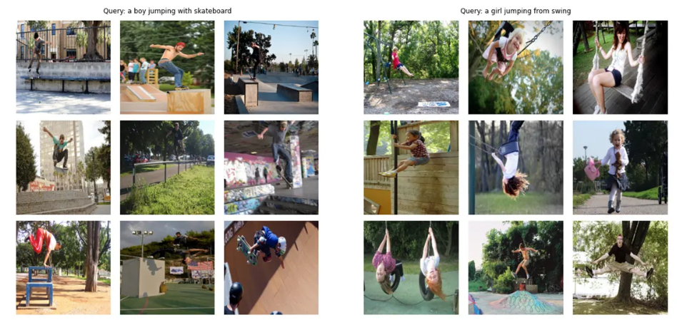

#### Stable Diffusion(=Latent Diffusion): 텍스트-조건부 생성의 대중화

또 다른 큰 축은 “이해”를 넘어 “생성”으로의 확장이다. Latent Diffusion은 고해상도 이미지를 픽셀 공간이 아니라 latent 공간에서 확산모델로 생성함으로써 계산 효율을 높였고, Stable Diffusion은 이를 널리 확산시키며 텍스트→이미지 생성의 대표 흐름을 만들었다[21].

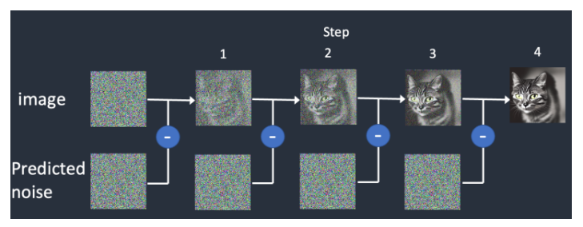
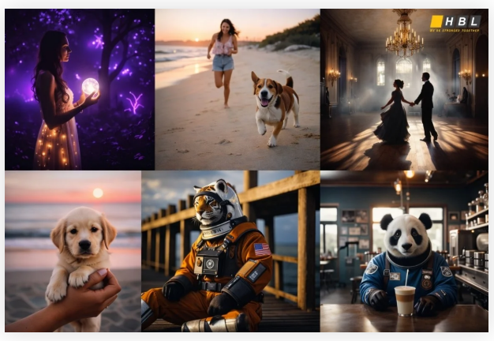

---

### 이후 연구 흐름: LLM / Vision / Multimodal로 확장

ViT와 MAE 이후 연구는 크게 세 축으로 빠르게 발전했다. 동시에 “모델을 어떻게 빠르고 싸게 제공(serve)할 것인가”라는 서빙/추론(inference) 축도 LLM 시대의 핵심 흐름으로 자리 잡았다.

- **(1) GPT류(Decoder-only LLM)의 고도화**
  - **스케일링과 프롬프트 기반 전이**: GPT-2(2019, *Language Models are Unsupervised Multitask Learners*), GPT-3(2020, *Language Models are Few-Shot Learners*)
  - **instruction tuning + RLHF로 정렬(alignment)**: InstructGPT(2022, *Training language models to follow instructions with human feedback*), FLAN(2022, *Finetuned Language Models Are Zero-Shot Learners*), Self-Instruct(2023, *Aligning Language Models with Self-Generated Instructions*)
  - **추론(Reasoning) + 도구사용(Agents) + 검색결합(RAG)**: Chain-of-Thought(2022), ReAct(2023), Toolformer(2023), RAG(2020)
  - **효율/메모리(학습·적응·추론) 핵심 기법**: RoPE(2021, RoFormer), LoRA(2022), FlashAttention(2022), QLoRA(2023)

- **(2) Vision Transformer의 확장**
  - 계층적 ViT로의 진화(다운스트림 비전 작업 친화): Swin(2021), PVT(2021)
  - 자기지도 학습 기반의 강한 표현 학습: DINO(2021), iBOT(2021), BEiT(2021), DINOv2(2023), EVA/EVA-02(2022/2023)
  - 생성 영역에서 Transformer의 역할 증가: Latent Diffusion(2022) / Stable Diffusion(2022), DiT(2022)

- **(3) 멀티모달(비전-언어) 결합이 실사용의 중심으로**
  - CLIP(2021) 이후, BLIP/BLIP-2(2022), Flamingo(2022), LLaVA(2023) 등
  - Vision encoder + LLM을 결합해 “이미지 이해 + 텍스트 생성”을 통합하는 방향으로 발전

- **(4) 서빙/추론(inference) 연구의 부상: 디코딩 병목과 KV cache**
  - GPT-2(2019)~GPT-3(2020) 이후, LLM 서빙의 핵심 병목은 “토큰을 한 개씩 생성하는 디코딩”과 “긴 컨텍스트로 커지는 KV cache 메모리”로 이동했다.
  - 이에 따라 커널/메모리 최적화(예: FlashAttention, 2022), 동적 배칭/스케줄링(continuous batching) 같은 시스템 최적화가 중요해졌다.
  - vLLM(2023)은 이 흐름에서 나온 대표 작업으로, PagedAttention으로 KV cache를 페이지 단위로 관리해 메모리 낭비/단편화를 줄이고 높은 처리량(throughput)의 LLM 서빙을 가능하게 했다.

### 번외

#### Transformer(Attention Is All You Need) 논문 인용 수

- **Google Scholar 기준(2026-05-06 조회)**: *Attention Is All You Need*(2017)은 **약 23만~24만+** 수준으로 인용되는 것으로 확인됨

#### 저자들은 뭐하고 사나?

논문 저자들은 이후 대규모 모델/제품화의 핵심 흐름을 주도했으며, 크게는 “대형 연구 조직(DeepMind/OpenAI 등)”과 “스타트업 창업/산업 확장”으로 퍼져 나갔다.

- **Ashish Vaswani**: 2022년 Adept 공동 창업(Chief Scientist)으로 “모델이 소프트웨어 도구를 사용하도록” 하는 방향의 연구/제품으로 확장
- **Noam Shazeer**: 2021년 Character.AI 공동 창업 후, 2024년 Google로 복귀해 대규모 모델 개발 흐름에 다시 합류한 것으로 보도됨
- **Jakob Uszkoreit**: Inceptive(바이오/신약·mRNA 설계) 창업으로 transformer 아이디어를 바이오 영역에 적용
- **Aidan Gomez**: Cohere 공동 창업으로 기업용 LLM/제품화 방향으로 확장
- **Llion Jones**: Sakana AI 공동 창업(2023)으로 연구/제품화를 지속
- **Illia Polosukhin**: NEAR Protocol 공동 창업 등(블록체인/AI 결합 비전 포함)으로 확장
- **Łukasz Kaiser**: 2021년 이후 OpenAI에서 연구를 이어가는 것으로 알려짐

#### Transformer 직후(2018~2020) “의심/반론/병목” 대표 논문 10선

Transformer가 널리 쓰이기 시작한 직후에는, (a) attention의 “설명 가능성”, (b) multi-head의 실효성, (c) O(n^2) 계산 병목, (d) 긴 문서 처리 한계 같은 지점에서 비판/대안 연구가 빠르게 쏟아졌다. 

1) Jain & Wallace (NAACL 2019), *Attention is not Explanation*  
2) Michel, Levy, Neubig (NeurIPS 2019), *Are Sixteen Heads Really Better than One?*  
3) Kovaleva et al. (2019), *Revealing the Dark Secrets of BERT*  
4) Beltagy, Peters, Cohan (ACL 2020), *Longformer: The Long-Document Transformer*  
5) Kitaev, Kaiser, Levskaya (ICLR 2020), *Reformer: The Efficient Transformer*  
6) Wang et al. (NeurIPS 2020), *Linformer: Self-Attention with Linear Complexity*  
7) Choromanski et al. (NeurIPS 2020), *Rethinking Attention with Performers*  
8) Katharopoulos et al. (ICML 2020), *Transformers are RNNs: Fast Autoregressive Transformers with Linear Attention*  
9) Cordonnier, Loukas, Jaggi (ICLR 2020), *On the Relationship between Self-Attention and Convolutional Layers*  
10) Tay et al. (2020), *Sparse Sinkhorn Attention*

## References

- [1] I. Sutskever, O. Vinyals, and Q. V. Le, "Sequence to sequence learning with neural networks," in Advances in neural information processing systems, 2014, pp. 3104-3112.
- [2] D. Bahdanau, K. Cho, and Y. Bengio, "Neural machine translation by jointly learning to align and translate," arXiv preprint arXiv:1409.0473, 2014. [ICLR 2015]
- [3] M.-T. Luong, H. Pham, and C. D. Manning, "Effective approaches to attention-based neural machine translation," arXiv preprint arXiv:1508.04025, 2015.
- [4] A. Vaswani et al., "Attention is all you need," in Advances in neural information processing systems, 2017, pp. 5998-6008.
- [5] T. Mikolov, K. Chen, G. Corrado, and J. Dean, "Efficient estimation of word representations in vector space," arXiv preprint arXiv:1301.3781, 2013. (Word2Vec)
- [6] M. Peters et al., "Deep contextualized word representations," arXiv preprint arXiv:1802.05365, 2018. (ELMo)
- [7] J. Devlin, M.-W. Chang, K. Lee, and K. Toutanova, "Bert: Pre-training of deep bidirectional transformers for language understanding," arXiv preprint arXiv:1810.04805, 2018.
- [8] A. Dosovitskiy et al., "An Image is Worth 16x16 Words: Transformers for Image Recognition at Scale," ICLR, 2021. (ViT)
- [9] K. He et al., "Masked Autoencoders Are Scalable Vision Learners," CVPR, 2022. (MAE)
- [10] G. Salton and C. Buckley, "Term-weighting approaches in automatic text retrieval," Information Processing & Management, 24(5), 1988. (TF-IDF)
- [11] Y. Kim, "Convolutional Neural Networks for Sentence Classification," EMNLP, 2014. (Kim CNN)
- [12] S. Hochreiter and J. Schmidhuber, "Long Short-Term Memory," Neural Computation, 9(8), 1997. (LSTM)
- [13] T. Mikolov et al., "Recurrent neural network based language model," Interspeech, 2010. (RNN LM)
- [14] A. Radford et al., "Improving Language Understanding by Generative Pre-Training," OpenAI Technical Report, 2018. (GPT-1)
- [15] T. Brown et al., "Language Models are Few-Shot Learners," NeurIPS, 2020. (GPT-3)
- [16] D. E. Rumelhart, G. E. Hinton, and R. J. Williams, "Learning representations by back-propagating errors," Nature, 323, 1986. (Backprop / early RNN training era)
- [17] J. L. Elman, "Finding structure in time," Cognitive Science, 14(2), 1990. (Elman RNN)
- [18] M. Caron et al., "Emerging Properties in Self-Supervised Vision Transformers," ICCV, 2021. (DINO)
- [19] M. Oquab et al., "DINOv2: Learning Robust Visual Features without Supervision," 2023. (DINOv2)
- [20] A. Radford et al., "Learning Transferable Visual Models From Natural Language Supervision," ICML, 2021. (CLIP)
- [21] R. Rombach et al., "High-Resolution Image Synthesis with Latent Diffusion Models," CVPR, 2022. (Latent Diffusion / Stable Diffusion)

